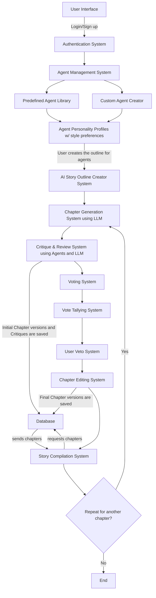

# System Block Diagram

```mermaid
graph TD
    A[User Interface] --> |Login/Sign up| B[Authentication System]
    B --> C[Agent Management System]
    C --> D[Predefined Agent Library]
    C --> E[Custom Agent Creator]
    D --> F[Agent Personality Profiles w/ style preferences]
    E --> F
    F --> |User creates the outline for agents| G[AI Story Outline Creator System]
    G --> H[Chapter Generation System using LLM]
    H --> I[Critique & Review System using Agents and LLM]
    I --> |Initial Chapter versions and Critiques are saved| J[Database]
    I --> K[Voting System]
    K --> L[Vote Tallying System]
    L --> M[User Veto System]
    M --> N[Chapter Editing System]
    N --> |Final Chapter versions are saved| J
    N --> P[Story Compilation System]
    P --> |requests chapters| J
    J --> |sends chapters| P
    P --> O{Repeat for another chapter?}
    O -->|Yes| H
    O -->|No| Q[End]
```
