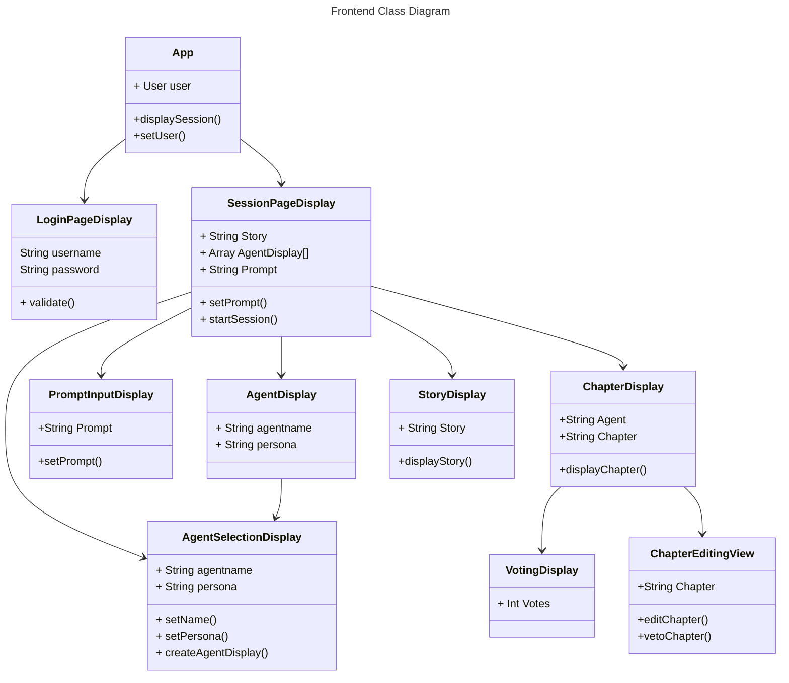
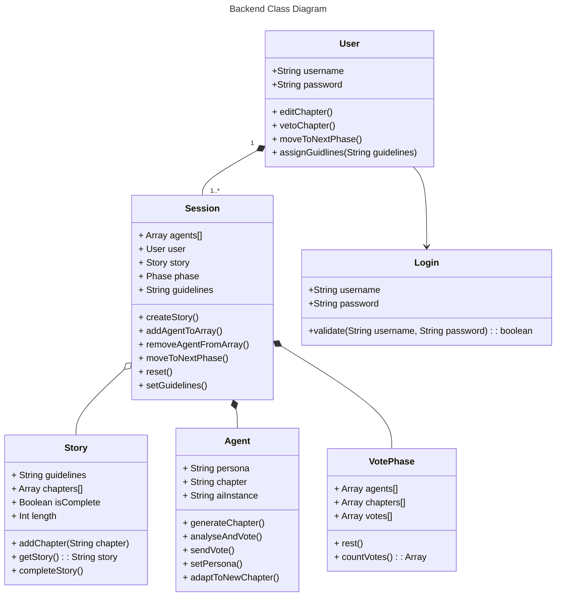

### Components

Provided below are descriptions of the different components and their interfaces.

#### Client/Frontend

This is a React-based web application that will require the use of a login page, a homeboard page, and a couple other accompanying pages (determined by the features added). The client will be connected to the server via a WebSocket connection that will allow for communication between the two components.

# App Class 
## Data Fields: 
    - 'User user' : Written guidelines for writing the story

## Methods: 
    - `displaySession()`
        Purpose: display the the session to the user
        Pre-conditions: There must be a user
        Post-conditions: The session is displayed to the user
        Parameters: Session
        Return value: Boolean

    - `setUser()` 
        Purpose: Set the user
        Pre-conditions: A user must be logged in
        Post-conditions: The user is set
        Parameters: User User
        Return value: Boolean

# LoginPageDisplay Class 
## Data Fields: 
    - 'String username' : Username field displayed to user
    - 'String password' : Password field displayed to user

## Methods: 
    - `validate()`
        Purpose: Validate the username and passowrd
        Pre-conditions: None
        Post-conditions: The username and password are found to be either valid or invalid
        Parameters: String Username, String Password
        Return value: Boolean

# SessionPageDisplay Class 
## Data Fields: 
    - 'String Story' : Username field displayed to user
    - 'Array AgentDisplay[]' : Password field displayed to user
    - 'String Prompt' : Username field displayed to user

## Methods: 
    - `setPrompt()`
        Purpose: Set the prompt
        Pre-conditions: A prompt was provided by the user
        Post-conditions: The prompt was set
        Parameters: String prompt
        Return value: Boolean

# PromptInputDisplay Class 
## Data Fields: 
    - 'String Prompt' : Prompt provided by the user

## Methods: 
    - `setPrompt()`
        Purpose: Set the prompt
        Pre-conditions: A prompt was provided by the user
        Post-conditions: The prompt was set
        Parameters: String prompt
        Return value: Boolean

# AgentDisplay Class 
## Data Fields: 
    - 'String Agentname' : Name of the agent
    - 'String Prompt' : Prompt provided by the user
    
## Methods: 

# StoryDisplay Class 
## Data Fields: 
    - 'String Story' : Prompt provided by the user

## Methods: 
    - `displayStory()`
        Purpose: Display the story to the user
        Pre-conditions: The user is on the story page
        Post-conditions: The story was shown to the user
        Parameters: String Story
        Return value: Boolean

# ChapterDisplay Class 
## Data Fields: 
    - 'String Agent' : An AI agent used to write the story
    - 'String Chapter' : A chapter of the story written by the agents

## Methods: 
    - `displayChapter()`
        Purpose: Display a chapter of the story to the user
        Pre-conditions: A story is being displayed to the user
        Post-conditions: The chapter was shown to the user
        Parameters: String Chapter
        Return value: Boolean

# AgentSelectionDisplay Class 
## Data Fields: 
    - 'String Agentname' : Name of an agent
    - 'String Persona' : Persona of an agent

## Methods: 
    - `selectAgent()`
        Purpose: Select an agent from the list of agents
        Pre-conditions: At least one agent exists
        Post-conditions: An agent was selected for writing
        Parameters: String Agentname
        Return value: Boolean
    - `createAgentDisplay()`
        Purpose: Display the agent creation page
        Pre-conditions: The user is navigating to the agent creation page
        Post-conditions: The agent creation page is shownn to the user
        Parameters: None
        Return value: Boolean

# VotingDisplay Class 
## Data Fields: 
    - 'int Votes' : Number of votes

## Methods: 

# ChapterEditingView Class 
## Data Fields: 
    - 'String Chapter' : A chapter of a story

## Methods: 
    - `editChapter()`
        Purpose: Allow the user to edit a chapter
        Pre-conditions: At least one chapter exists
        Post-conditions: The user is able to edit a chapter
        Parameters: String Chapter
        Return value: Boolean
    - `vetoChapter()`
        Purpose: Allow the user to veto a chapter
        Pre-conditions: At least one chapter exists
        Post-conditions: A chapter was vetoed
        Parameters: String Chapter
        Return value: Boolean

#### Backend

The backend is built using JavaScript, with Node.js and Express. It handles data sent from the other components and processes it. 

**Figure 1.1** blah blah blah description

# Session Class 
## Data Fields: 
    - 'Array Agents' : Stores each of the agents that we will be utilizing to vote on the current version of the story and each new generation.
    - 'User user' : Object representing a User.
    - 'Story story' : Object representing a Story.
    - 'Phase phase' : Object representing a Phase. 
    - 'String guildlines' : Contains the outline for the entities within the system to follow the storybuilding process.

## Methods: 
    - `createStory()`
        Purpose: To initialize a story for the session.
        Pre-conditions: The session has begun and active.
        Post-conditions: A story is added to the session.
        Parameters: Story, User
        Return value: Story

    - `addAgentToArray()` 
        Purpose: Take an agent object and add it to the Agent array.
        Pre-conditions: The story must be initialized.
        Post-conditions: The story is unchanged, but an Agent is added to the session.
        Parameters: Agents
        Return value: Array

    - `removeAgentFromArray()` 
        Purpose: Take an agent object and remove it from the Agent array.
        Pre-conditions: The story must be initialized.
        Post-conditions: The story is unchanged, but an Agent is removed from the session.
        Parameters: Agents
        Return value: Array

    - `moveToNextPhase()` 
        Purpose: Initiate the next phase for the storybuilding process (generation of a specific content).
        Pre-conditions: The story must be initialized, with no current and incomplete generation process.
        Post-conditions: The next phase of the process is now begun.
        Parameters: Phase
        Return value: Phase

    - `reset()`
        Purpose: To reset the session and its story and parameters.
        Pre-conditions: The session has begun (User is logged in) and the story is initialized or in development.
        Post-conditions: The entire session is reset.
        Parameters: Story, User, Phase, Agents
        Return value: Story, String

    - `setGuidelines()`
        Purpose: To outline the User's intended guidelines for their story.
        Pre-conditions: The story is initialized, but a chapter has not been generated yet.
        Post-conditions: A guideline for the story is completed.
        Parameters: guidelines
        Return value: String

# Story Class 
## Data Fields: 
    - 'String guidelines' : Written guidelines for writing the story
    - 'Array chapters' : Stores each chapter of the story
    - 'Boolean isComplete' : Whether the story is complete or not
    - 'int length' : length of the story in chapters

## Methods: 
    - `addChapter()`
        Purpose: Add a chapter to the story
        Pre-conditions: The story must be initialized
        Post-conditions: A chapter is added to the story
        Parameters: Chapter
        Return value: Boolean

    - `getStory()` 
        Purpose: Get the text of the story
        Pre-conditions: The story must be created with at least one chapter
        Post-conditions: The story is unchanged
        Parameters: Story
        Return value: String

    - `completeStory()`
        Purpose: complete the story
        Pre-conditions: The story is initialized
        Post-conditions: The story is completed
        Parameters: Story
        Return value: Story

# Agent Class 
## Data Fields: 
    - 'String persona' : Stores speficifed infornation about the agents character like an author to imitate
    - 'String chapter' : Stores most recently generated chapter 
    - 'String aiInstance' : Stores connection to AI 

## Methods: 
    - `generateChapter()`
        Purpose: Generates a chapter by the agent 
        Pre-conditions: The agent must be generated, a prompt must be avalible to utilize. 
        Post-conditions: Creates a chapter based on condtions give. 
        Parameters: prompt, context 
        Return value: string chapter

    - `analyseAndVote()` 
        Purpose: Agent will judge other chapters based on our critera and cast a vote based on judgement 
        Pre-conditions: The agent must be generated, chapters from all agents must be generated 
        Post-conditions: Choose Vote
        Parameters: None
        Return value: String AgentVotedFor 

    - `sendVote()`
        Purpose: Will send the vote to be tallied 
        Pre-conditions: The agent has run analyzeAndVote() and returned a value 
        Post-conditions: Cast a vote 
        Parameters: String vote
        Return value: Boolean 

    - `setPersona()`
        Purpose: Set persona
        Pre-conditions: The agent is created the stpry creation has not started 
        Parameters: String persona 
        Return value: Boolean 
# VotePhase Class
## Data Fields
    - 'Array Agents' : Stores each of the agents that we will be utilizing to vote on the current version of the story and each new geenration
    - 'Array Chapters' : Each of the stories chapters that will be generated will be kept here. ex. Chapter 1, 2....
    - 'Array Votes' : Each of the agents votes will be stored to evaluate the total votes casted onto the story

        
## Methods

    - `rest()`
        Purpose: Stops the Agent generation of new material to allow for user reading/revision/etc
        Pre-conditions: The agents have started generating material and are added to the story
        Parameters: None
        Return Value: String
    - `countVotes()`
        Purpose: Gathers the agent vote on what they believe to be the best generated material for the story
        Pre-conditions: Material is present and generated for revision and agents are added onto the story
        Parameters: Array - Agents
        Return Value: Array

# Login Class
## Data Fields
- 'String username' : Personalized name created by the user
- 'String password' : Each account has a password which secures the account and is used to login

## Methods 
- `validate()`
  Purpose: Validates user's account and ensures that user can login into their personal account
  Pre-conditions: User has previously created an account and made a username and password
  Parameters: String username and String password
  Return Value: Boolean
        

#### Database

Firebase is used to store all of the necessary information generated and needed by the system to create the storyboard and drive user interaction. The database will contain information about chapters in the story, user data, and the generated critiques, goals, and votes.

#### LLM

The OpenAI API is used to generate content. It is connected to the Agents who request data for transmission and generation.
