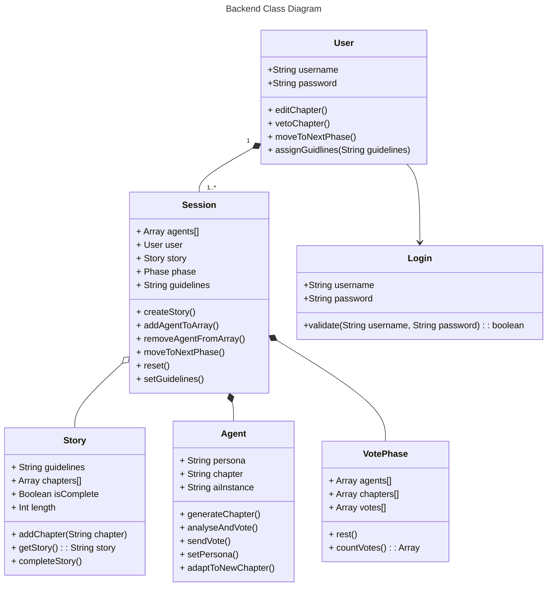

# Design Document

**Purpose**

The Design Document - Part I Architecture describes the software architecture and how the requirements are mapped into the design. This document will be a combination of diagrams and text that describes what the diagrams are showing.

### Components

Provided below are descriptions of the different components and their interfaces.

#### Client/Frontend

This is a React-based web application that will require the use of a login page, a homeboard page, and a couple other accompanying pages (determined by the features added). The client will be connected to the server via a WebSocket connection that will allow for communication between the two components.

#### Backend

The backend is built using JavaScript, with Node.js and Express. It handles data sent from the other components and processes it. 

**Figure 1.1** blah blah blah description

# Agent Class 
## Data Fields: 
    - 'String persona' : Stores speficifed infornation about the agents character like an author to imitate
    - 'String chapter' : Stores most recently generated chapter 
    - 'String aiInstance' : Stores connection to AI 

## Methods: 
    - `generateChapter()`
        Purpose: Generates a chapter by the agent 
        Pre-conditions: The agent must be generated, a prompt must be avalible to utilize. 
        Post-conditions: Creates a chapter based on condtions give. 
        Parameters: prompt, context 
        Return value: string chapter

    - `analyseAndVote()` 
        Purpose: Agent will judge other chapters based on our critera and cast a vote based on judgement 
        Pre-conditions: The agent must be generated, chapters from all agents must be generated 
        Post-conditions: Choose Vote
        Parameters: None
        Return value: String AgentVotedFor 

    - `sendVote()`
        Purpose: Will send the vote to be tallied 
        Pre-conditions: The agent has run analyzeAndVote() and returned a value 
        Post-conditions: Cast a vote 
        Parameters: String vote
        Return value: Boolean 

    - `setPersona()`
        Purpose: Set persona
        Pre-conditions: The agent is created the stpry creation has not started 
        Parameters: String persona 
        Return value: Boolean 

        

#### Database

Firebase is used to store all of the necessary information generated and needed by the system to create the storyboard and drive user interaction. The database will contain information about chapters in the story, user data, and the generated critiques, goals, and votes.

#### LLM

The OpenAI API is used to generate content. It is connected to the Agents who request data for transmission and generation.

### Use-Case Sequence Diagrams

**Use Case 1:** Account Creation 

Use Case 1 Description

1. User creates account with email. 
2. User makes a password. 
3. User signs into account. 

**Figure 1.2 (shown below)**

**Use Case 2:** User adds Agents

Use Case 2 Description

1. User adds number of AI agents. 
2. User selects personas for each agent. 

**Figure 1.3 (shown below)**

**Use Case 3:** Initial Story Creation

Use Case 3 Description

1. User defines genre and plot for the story. 
2. User provides agents with key details required for the story. 

**Figure 1.4 (shown below)**

**Use Case 4:** Vote and Approve 

Use Case 4 Description

1. Agents vote for the best story. 
2. User votes approved the most voted story. 
3. The story proceeds using the most voted chapter. 

**Figure 1.5 (shown below)**

**Use Case 5:** Veto 

Use Case 5 Description

1. Agents vote for the best story. 
2. User vetoes the most voted story and chooses a different story. 
3. The story proceeds using the chosen chapter. 

**Figure 1.6 (shown below)**

**Use Case 6:** Critiques

Use Case 6 Description

1. User provides critiques to AI agents about the story. 
2. User includes more details or changes to the story.

**Figure 1.7 (shown below)**

**Use Case 7:** Draft Revision

Use Case 7 Description

1. Agent creates drafts and updates the story based on user’s critiques. 
2. Agents vote for the best revised story. 
3. User votes for the best story or vetoes against agents.  
4. Agents continue with the next chapter. 

**Figure 1.8 (shown below)**

**Use Case 8:** Story Mode 

Use Case 8 Description

1. User enters reading mode. 
2. User can read a completed story. 

**Figure 1.9 (shown below)**

**Use Case 9:** Final Draft 

Use Case 9 Description

1. Agents write the final version of the story. 
2. User ends the story. 

**Figure 1.10 (shown below)**

**Use Case 10:** Account History 

Use Case 10 Description

1. User can access previous completed stories written by agents. 
2. User can open the completed stories in reading mode.  

**Figure 1.11 (shown below)**

**Use Case 11:** Access Previous Drafts During Session 

Use Case 11 Description

1. User can go back to previous drafts that were not voted for by the user and agents. 
2. User can choose to continue to write with chosen draft. 

**Figure 1.12 (shown below)**

### State-Flow Diagram

**Figure 1.13 (shown above)** depicts the State Flow Diagram for StoryBuilder. It is composed of 4 main parts: Web App/Frontend, Agents/LLM, Backend, and Database. The flow begins with user interaction with the Frontend, where the first phase is activated: Agent Outline Generation. In this phase there is communication between the Agents, the LLM & the Backend to generate content and reflect on that content. In Generation there are 3 main stages: Voting, Tally & Selection, and Editing. In Reflection there are two added stages: Agent Critique Generation & Agent Goal Generation (these two stages execute and then the system runs through the three Generation stages once more). After the Outline Generation the second phase, Agent Chapter Generation, runs until enough chapters have been generated. The Chapter Generation phase also runs through a similar process as the Outline Generation phase with the Generation and Reflection stages. After every Agent Chapter Generation phase is complete (after every added chapter), the Backend is activated to execute the Story Compilation System to compile chapters into a story. During the flow, the Database is connected to various systems and is utilized to store and retrieve data.
- Web App: contains the User Interface, Authentication System, & Agent Management.
    - a User can interact with the various components on the page to Login/Sign up, select Agent profiles by either creating a new agent or using a pre-existing agent pool.
- Backend: contains the Story Compilation System, Voting System, Vote Tally & Selection component, and Editing System.
- Agents/LLM: contains the Agent Outline, Agent Chapter, Agent Critique, and Agent Goal Generation.
    - within this, the Agents will be prompted by the Backend to generate content. 
    - the agents will request/GET data from the LLM API to generate the content and complete the task they have been given.
    - the generated content is stored in the database and sent to the backend for future use.
- Database: is composed of multiple tables to store the data generated and require by the agents and User

### Entity-Relation Diagram (for Database)

**Figure 1.14 (shown below)**

- add description for the diagram

