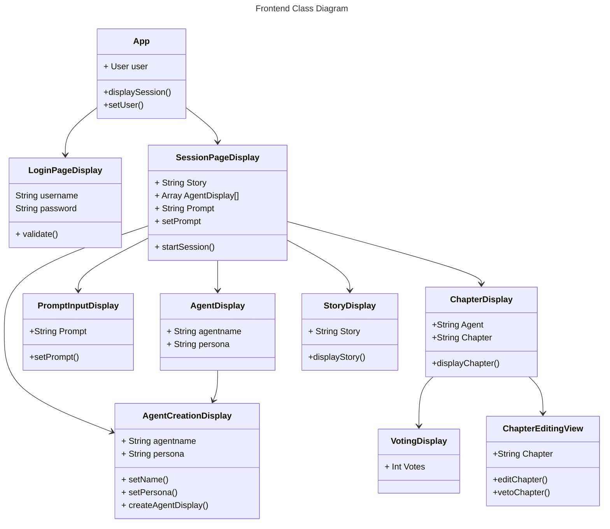

```mermaid 
---
title: Frontend Class Diagram 
---

classDiagram
    App --> LoginPageDisplay
    App --> SessionPageDisplay
    SessionPageDisplay --> AgentDisplay
    SessionPageDisplay --> AgentCreationDisplay
    SessionPageDisplay --> PromptInputDisplay
    AgentDisplay --> AgentCreationDisplay
    SessionPageDisplay --> ChapterDisplay
    SessionPageDisplay --> StoryDisplay
    ChapterDisplay --> VotingDisplay
    ChapterDisplay --> ChapterEditingView 

    class App{
        + User user 

        +displaySession() 
        +setUser()
    }

    class LoginPageDisplay{
        String username
        String password

        + validate()
    }

    class SessionPageDisplay{
      + String Story
      + Array AgentDisplay[] 
      + String Prompt

      + setPrompt
      + startSession() 

      
    }

    class PromptInputDisplay{
        +String Prompt

        +setPrompt()
    }

    class AgentDisplay{
        + String agentname
        + String persona
    }

    class AgentCreationDisplay{
        + String agentname 
        + String persona

        + setName() 
        + setPersona() 
        + createAgentDisplay() 
    }

    class ChapterDisplay{
        +String Agent 
        +String Chapter 

        +displayChapter()
    }

    class ChapterEditingView{
        +String Chapter 

        +editChapter() 
        +vetoChapter() 
    }

    class VotingDisplay{
        + Int Votes
    }

    class StoryDisplay{
        + String Story 

        +displayStory()
    }
```
